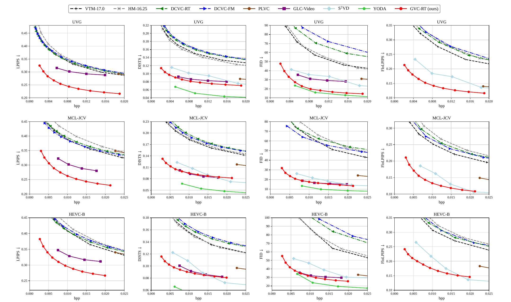
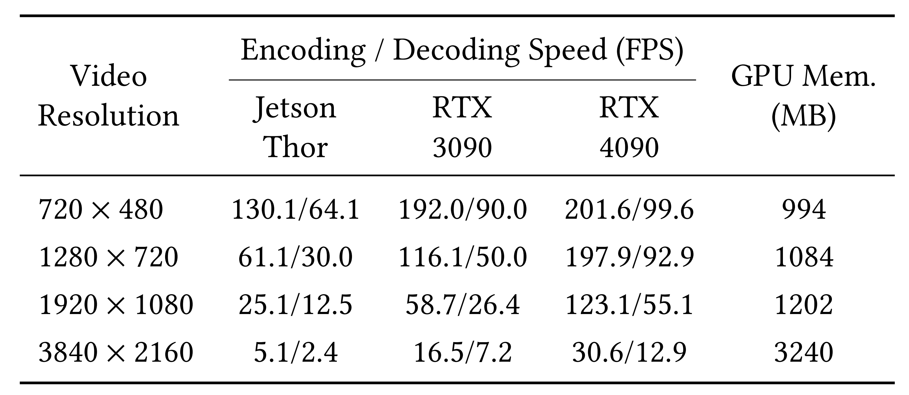

# GVC-RT: Towards Real-Time Generative Video Compression at Ultra-Low Bitrates

<p align="center">
  <a href="https://arxiv.org/abs/2608.04891">
    
  </a>
</p>

This repository provides the official code for **GVC-RT**, a generative video codec designed for perceptual compression at ultra-low bitrates while retaining real-time coding speed.

:fire: **GVC-RT is accepted by ACM MM 2026.**

⭐ If **GVC-RT** is helpful to you, please star this repo. Thanks! 🤗

## ✅ TODO

- [x] ~~Repo release~~
- [x] ~~Inference code release~~
- [x] ~~Pretrained models~~
- [ ] Demo
- [ ] Training code release

## 📝 Abstract

Recent generative video codecs (GVCs) have achieved impressive reconstruction fidelity at ultra-low bitrates (< 0.02 bits per pixel) by compressing the tokens from generative tokenizers. However, existing GVCs generally require considerable computation time and model complexity, which hinder their deployment on compute-limited devices and in real-time applications. To bridge this gap, we systematically identify the computational bottlenecks and propose GVC-RT, which redesigns the generative latent coding framework to realize real-time video coding without sacrificing compression performance. Specifically, built on a pretrained lookup-free quantization (LFQ) tokenizer, GVC-RT adopts an asymmetric architecture that directly learns to match the LFQ latent distribution, while generative-space alignment is enforced via a regularization loss term only during training. In this manner, we bypass heavy tokenization and entirely remove the complex feature-alignment process at inference time. Moreover, we further introduce a lightweight de-tokenizer architecture to resolve the final latency bottleneck during decoding. Experimental results demonstrate that GVC-RT outperforms the previous SOTA model, GLC-Video, with average BD-rate savings of 12.4% and 48.8% in terms of DISTS and LPIPS, while achieving encoding/decoding speeds of 123.1/55.1 fps for 1080p video.

## 📊 Performance Evaluation

GVC-RT is evaluated on UVG, MCL-JCV, and HEVC-B using LPIPS, DISTS, FID, and FloLPIPS. The rate-perceptual curves are shown below.

<p align="center">
  
</p>

## ⚡ Runtime and Memory

The encoding/decoding speed is reported in FPS across different resolutions and devices, while GPU memory is reported in MB across different resolutions. GPU memory usage is not constant during inference; the memory column reports only the peak GPU memory observed in a single run on an RTX 4090.

<p align="center">
  
</p>


## 📦 Repository Layout

```text
.
├── checkpoints/
│   ├── GVC_RT-I.pt                # Pretrained I-frame model
│   └── GVC_RT-P.pt                # Pretrained P-frame model
├── src/
│   ├── cpp/                       # C++ entropy-coding extension adapted from DCVC-RT
│   ├── layers/                    # Neural layers and CUDA kernels adapted from DCVC-RT
│   ├── models/                    # GVC-RT image/video models
│   └── utils/                     # Frame I/O, bitstreams, metrics, transforms adapted from DCVC-RT
├── test_video_gvcrt_1088.py       # The single 1088-line benchmark entry point
├── UVG_rgb.json                   # Example RGB benchmark configuration
├── requirements.txt
└── README.md
```

## ⚙️ Environment

The reference environment is:

- Python 3.12.12
- PyTorch 2.6.0 with CUDA 12.4 (`2.6.0+cu124`)
- NVIDIA GPU with a compatible driver
- Linux build tools for the native extensions

```bash
conda create -n gvc-rt python=3.12 -y
conda activate gvc-rt
pip install -r requirements.txt
```

## 🛠️ Build Native Extensions

To achieve efficient GVC inference, we use the open-source [DCVC-RT Extensions](https://github.com/microsoft/DCVC/tree/main/src/layers/extensions/inference).

Install the system build tools:

```bash
sudo apt-get update
sudo apt-get install -y g++ ninja-build
```

The C++ extension is required for arithmetic/range coding and bitstream generation. The CUDA extension is recommended for speed:

```bash
cd src/cpp
pip install .
cd ../..

cd src/layers/extensions/inference
pip install .
cd ../../../..
```

If the fused CUDA extension cannot be loaded, the model falls back to the PyTorch implementation. The fallback is slower, but the C++ extension is still required when `--write_stream true` is used.

## 📥 Pretrained Models

Download the pretrained models from the [GVC-RT model release](https://drive.google.com/drive/folders/1cI1KWy-sfujSc2YsUxVWfhX7qcOJIxhS?usp=sharing) and place them in `./checkpoints/`:

```text
checkpoints/
├── GVC_RT-I.pt
└── GVC_RT-P.pt
```

## 🗂️ Input Configuration

`UVG_rgb.json` controls which sequences are tested and how the input data is located. Its structure is:

```json
{
  "root_path": "/path/to/datasets/",
  "test_classes": {
    "UVG": {
      "test": 1,
      "base_path": "UVG/standard",
      "src_type": "png",
      "sequences": {
        "Bosphorus": {
          "width": 1920,
          "height": 1080,
          "frames": 600,
          "intra_period": -1
        }
      }
    }
  }
}
```

The input frames are resolved as `<root_path>/<base_path>/<sequence>/im*.png`.

| Field | Meaning |
| --- | --- |
| `root_path` | Dataset root directory; `--force_root_path` overrides it. |
| `test_classes.<name>.test` | `1` enables a dataset entry; `0` skips it. |
| `base_path` | Dataset path relative to `root_path`. |
| `src_type` | `png` for RGB frames or `yuv420` for raw YUV420 input. |
| `width`, `height` | Original frame dimensions. |
| `frames` | Number of frames to process. |
| `intra_period` | I-frame interval; `-1` means only the first frame is an I-frame. |

The 1088 benchmark script pads the processing **1080p** canvas to **1088×1920**. Distortion evaluation and reconstructed-frame writing are cropped back to the configured dimensions; bitrate accounting and timing use the padded processing canvas.

## 🧪 Run the Test

Run from the repository root. The current benchmark requires `--write_stream true`:

```bash
python test_video_gvcrt_1088.py \
  --model_path_i ./checkpoints/GVC_RT-I.pt \
  --model_path_p ./checkpoints/GVC_RT-P.pt \
  --rate_num 4 \
  --qp_i 0 1 2 3 \
  --qp_p 0 1 2 3 \
  --test_config ./UVG_rgb.json \
  --cuda true \
  --cuda_idx 0 \
  --worker 1 \
  --write_stream true \
  --stream_path ./out_bin \
  --output_path ./output.json \
  --force_zero_thres 0.12 \
  --force_intra_period -1 \
  --reset_interval 96 \
  --force_frame_num 96 \
  --check_existing false \
  --save_decoded_frame false \
  --calc_ssim true \
  --verbose 1
```

`--rate_num` must equal the number of values supplied to both `--qp_i` and `--qp_p`. For a single rate point, use `--rate_num 1 --qp_i 1 --qp_p 1`. The model supports up to ten rate points.

Important options:

- `--cuda` and `--cuda_idx`: enable GPU execution and select the GPU.
- `--worker`: number of worker processes; use one worker for one GPU.
- `--force_frame_num`: overrides `frames`; `-1` uses the configured count.
- `--force_intra_period`: overrides `intra_period`; `--force_intra true` makes every frame an I-frame.
- `--reset_interval`: controls periodic P-frame feature-adaptor resets.
- `--force_zero_thres`: controls the entropy-model zero threshold.
- `--write_stream`: writes `.bin` bitstreams below `--stream_path`.
- `--check_existing`: reuses existing bitstreams and results when the frame count matches.
- `--save_decoded_frame`: writes reconstructed frames.
- `--calc_ssim`: enables MS-SSIM calculation.
- `--verbose`: use `1` for sequence-level timing and `2` for frame-level timing.

The top-level `--output_path` stores aggregated results. Per-sequence bitstreams and logs are written below `--stream_path/<dataset_name>/`.

## 📚 Citation

If you find this project useful, please cite:

```bibtex
@misc{dang2026gvcrtrealtimegenerativevideo,
  title         = {GVC-RT: Towards Real-Time Generative Video Compression at Ultra-Low Bitrates},
  author        = {Tianjian Dang and Sixian Wang and Lei Luo and Guo Lu and Jincheng Dai},
  year          = {2026},
  eprint        = {2608.04891},
  archivePrefix = {arXiv},
  primaryClass  = {eess.SP},
  url           = {https://arxiv.org/abs/2608.04891}
}
```

## 🥰 Acknowledgement

This work is built upon [DCVC-RT](https://github.com/microsoft/DCVC) and [Open-MAGVIT2](https://github.com/TencentARC/Open-MAGVIT2). We sincerely thank their authors and contributors for their valuable open-source contributions.
